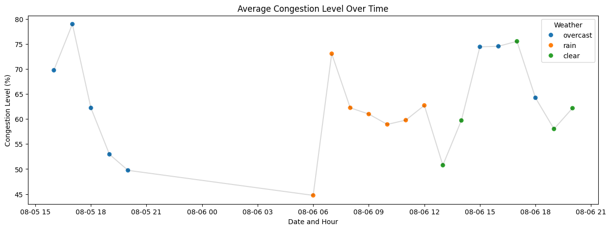
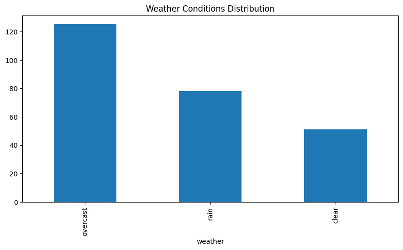
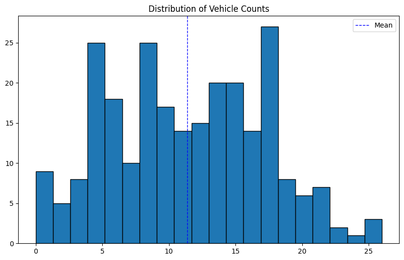
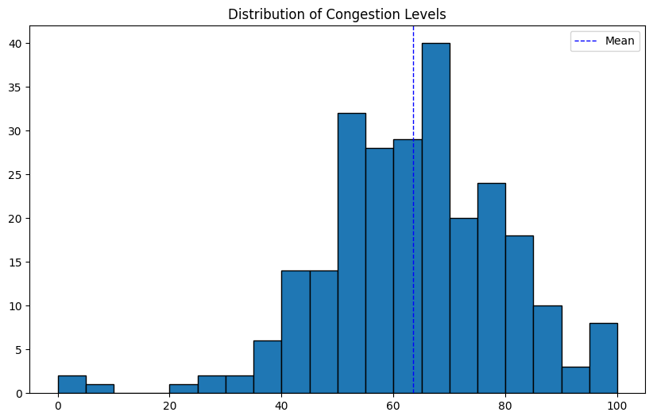

# Traffic Analysis Using YOLOv10

## Introduction
This report presents an analysis of traffic congestion levels and vehicle counts over time, segmented by weather conditions. The analysis is based on the dataset provided in [Traffic Dataset](https://www.kaggle.com/datasets/aryashah2k/highway-traffic-videos-dataset/data) which is processed using YOLO model and visualized using Python libraries such as Pandas, Matplotlib, and Seaborn.
### Getting Started
To run this script, ensure you have the required libraries installed:
```bash
pip -r requirements.txt
```
then execute the main script:
```bash
python main.py
```
**NOTE**: Make sure to have the dataset downloaded and placed in the appropriate directory named `video` as specified in the code.
### Data Sources
- [Traffic Dataset](https://www.kaggle.com/datasets/aryashah2k/highway-traffic-videos-dataset/data)
### Model
The YOLO model is used for object detection in the traffic videos. The model processes each video to detect and count vehicles, and assess congestion levels. In this analysis, a pre-trained YOLO model ([YOLOv10s](https://docs.ultralytics.com/models/yolov10/)) is used for efficient and accurate detection.
### Output 
The processed videos are generated and saved in the `output_videos/` directory. 

## Overview
This report provides an analysis of traffic congestion levels and vehicle counts over time, segmented by weather conditions. The data is visualized using line plots, scatter plots, bar charts, and box plots to illustrate trends and distributions.

## Code Description: main.py

The `main.py` script implements a comprehensive traffic analysis pipeline using YOLOv10 for vehicle detection and tracking. Here is a detailed breakdown of each step:

### 1. Helper Functions

#### `calculate_congestion(tracking_speeds: dict) -> float`
Computes the congestion level based on average vehicle speeds. The algorithm assumes that congested traffic exhibits lower average speeds. It calculates the mean speed across all vehicles and normalizes it against a maximum expected speed of 97 Km/h for the specific road, returning a value between 0.0 (free flow) and 1.0 (fully congested).

#### `get_xy_in_meter(x, y, roi) -> tuple`
Converts pixel coordinates from the video frame to real-world coordinates in meters using perspective transform. It maps a 23-meter-wide by 31.5-meter-long road section from pixel space to world space, enabling accurate speed calculations and spatial analysis.

#### `get_lane(box_center: tuple, lane_polygons: dict) -> str`
Determines which of the 5 lanes a detected vehicle occupies by checking if the vehicle's center point falls within a lane's polygon. Returns the lane identifier (lane1 through lane5).

#### `check_lane_changes(tracking_lanes: dict) -> None`
Monitors vehicle lane changes by comparing consecutive lane assignments. When a vehicle switches lanes, it prints a notification with the vehicle ID and lane transition.

#### `define_lane_polygons() -> dict`
Defines the 5 lanes of the highway as polygon vertices in pixel coordinates. Each lane is precisely mapped based on the road geometry captured in the video.

#### `define_road_roi() -> np.ndarray`
Specifies the main road region of interest (ROI) as a quadrilateral polygon. This defines the area where traffic analysis will occur.

### 2. Configuration Setup

The script initializes several key parameters:
- **VIDEOS_DIR**: Directory containing input traffic videos
- **MODEL_PATH**: Path to the YOLOv10s pre-trained model (yolov10s.pt)
- **CONF_THRESHOLD**: Confidence threshold (0.4) for YOLO detections
- **SPEED_CORRECTION_FACTOR**: Calibration factor (130) for speed calculations based on observed vs. expected maximum speeds
- **VISUALIZATION_SCALE**: Display scale factor (3x) for video output
- **VEHICLE_CLASSES**: YOLO class IDs to track: cars (2), motorcycles (3), buses (5), trucks (7)

An output report DataFrame is created to store summary statistics for each video.

### 3. Road Geometry Definition

Lane polygons and the road ROI are defined using pixel coordinates from the video frame, establishing the spatial framework for vehicle tracking and analysis.

### 4. Main Processing Loop

For each video in the dataset:

#### Step 4.1: Video Setup
- Open the video file and skip the first frame (often corrupted in the dataset)
- Extract video properties: resolution, frame rate (FPS), and total frame count
- Initialize tracking data structures:
  - `vehicles`: Set of unique vehicle IDs
  - `tracking_centers`: Vehicle positions across frames (pixels)
  - `tracking_speeds`: Vehicle speed history (Km/h)
  - `tracking_lanes`: Vehicle lane assignment history
- Initialize a VideoWriter for output visualization

#### Step 4.2: Frame-by-Frame Processing
For each frame in the video:

1. **YOLO Detection & Tracking**: Run YOLOv10 with the BotsortTracker to detect and track vehicles across frames, maintaining persistent IDs.

2. **Visualization Preparation**: 
   - Scale the frame for display (3x larger)
   - Draw the road ROI boundary in red
   - Create a semi-transparent colored overlay for each lane (with 15% opacity)

3. **Detection Processing**: For each detected vehicle:
   - Verify it belongs to a tracked vehicle class (car, motorcycle, bus, truck)
   - Extract bounding box coordinates and calculate center point
   - Verify the vehicle is within the road ROI
   - Convert pixel coordinates to real-world meters using perspective transform
   - Determine which lane the vehicle occupies and increment lane occupancy counter
   - Calculate vehicle speed:
     - Compute Euclidean distance traveled between consecutive frames
     - Apply speed correction factor and convert to Km/h: `distance_m × 130 × 3.6 / FPS`
   - Store position history for trajectory visualization

4. **Annotations & Visualization**:
   - Draw vehicle trajectory as connected red lines showing past positions
   - Draw blue bounding boxes around detected vehicles
   - Display vehicle class, tracking ID, and speed in Km/h above each box
   - Detect and print lane changes

5. **Statistics Display**: Show in the frame:
   - Total vehicle count
   - Occupancy count for each of the 5 lanes

6. **Output**: Write the annotated frame to the output video file

#### Step 4.3: Statistics Calculation
After processing all frames in a video:
- Count unique vehicles detected
- Calculate **Traffic Density**: Number of vehicles × 1000 / road length (31.5m), expressed as vehicles per unit road kilometer
- Calculate **Congestion Level**: Derived from average vehicle speeds, expressed as a percentage where 0% = free flow and 100% = fully congested
- Record results in the output report

#### Step 4.4: Cleanup
Release video capture and writer resources, close display windows

### 5. Final Report Generation

After processing all videos:
- Create an `output_reports` directory (if it doesn't exist)
- Save a CSV file (`traffic_report.csv`) containing:
  - Video name
  - Vehicle count
  - Traffic density
  - Congestion level (%)
- Print completion message

### Output Files

- **output_videos/**: Contains video files with vehicle tracking visualizations, bounding boxes, trajectories, and statistics
- **output_reports/**: Contains `traffic_report.csv` with aggregate traffic metrics for each processed video

## Visualizations

### Average Congestion Level Over Time

This plot shows the average congestion level over time, with data points colored by weather conditions. The black line represents the overall trend.
### Average Vehicle Count Over Time

This plot illustrates the average vehicle count over time, with data points colored by weather conditions. The black line indicates the overall trend.
Upon investigating the change in both congestion levels and vehicle counts in rainy conditions, we observe a decline in the quality of input data in these conditions. This indicates the need for further model fine tuning on harder weather conditions to improve detection accuracy.


Upon further analysis, we observe the following distributions:
### Weather Conditions Distribution

This bar chart displays the distribution of different weather conditions in the dataset. This may imply data imbalance which may affect model performance in underrepresented conditions.
### Vehicle Count by Weather Condition

This box plot shows the distribution of vehicle counts across different weather conditions. Which can help identify how weather impacts traffic volume. This may also indicate the need for model fine tuning on harder weather conditions to improve detection accuracy.
### Congestion Level by Weather Condition

The final box plot illustrates the distribution of congestion levels across different weather conditions, providing insights into how weather affects traffic congestion. 